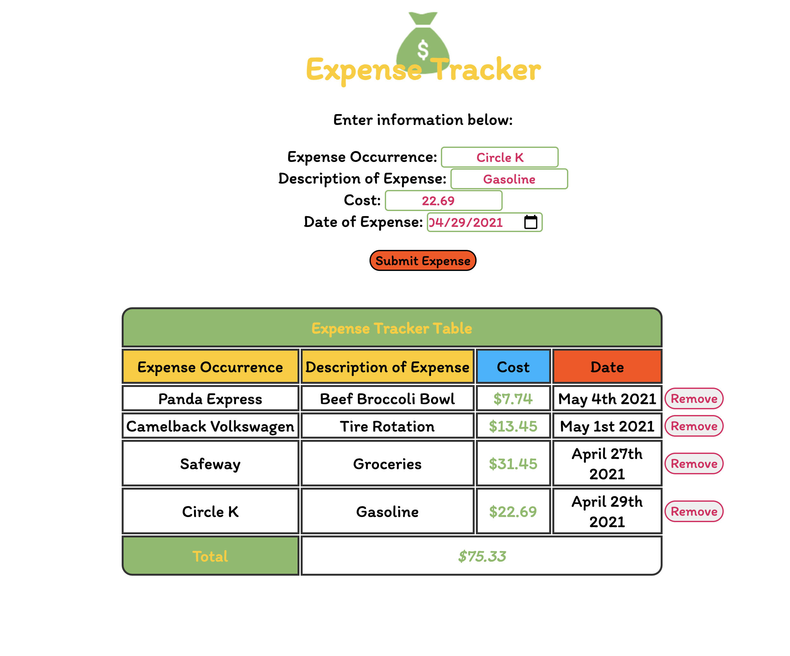

# A Simple Expense Calculator App

*A simple and fun Expense Calculator App written pure HTML, CSS, and vanilla JavaScript*

Check it out <a href="https://andrew-k191.github.io/expenseCalculator-app"/>here</a>!

## Summary

Of the prior projects I completed, I had the most fun working on this project. Part of the reason is that I already had a personal expense calculator that I used in Microsoft Word. I think it helped give me an idea of how I wanted to setup and implement the logic of this app. Nevertheless there were still issues I encountered along the way. In particular, I had problems figuring out how to calculate and continously update the total cost. I also encountered problems configuring the output of the date. 

I'm excited to get started on the next project!

## Author

* **Andrew Knight** - *Aspiring Software Developer* - (Website)|(LinkedIn)

